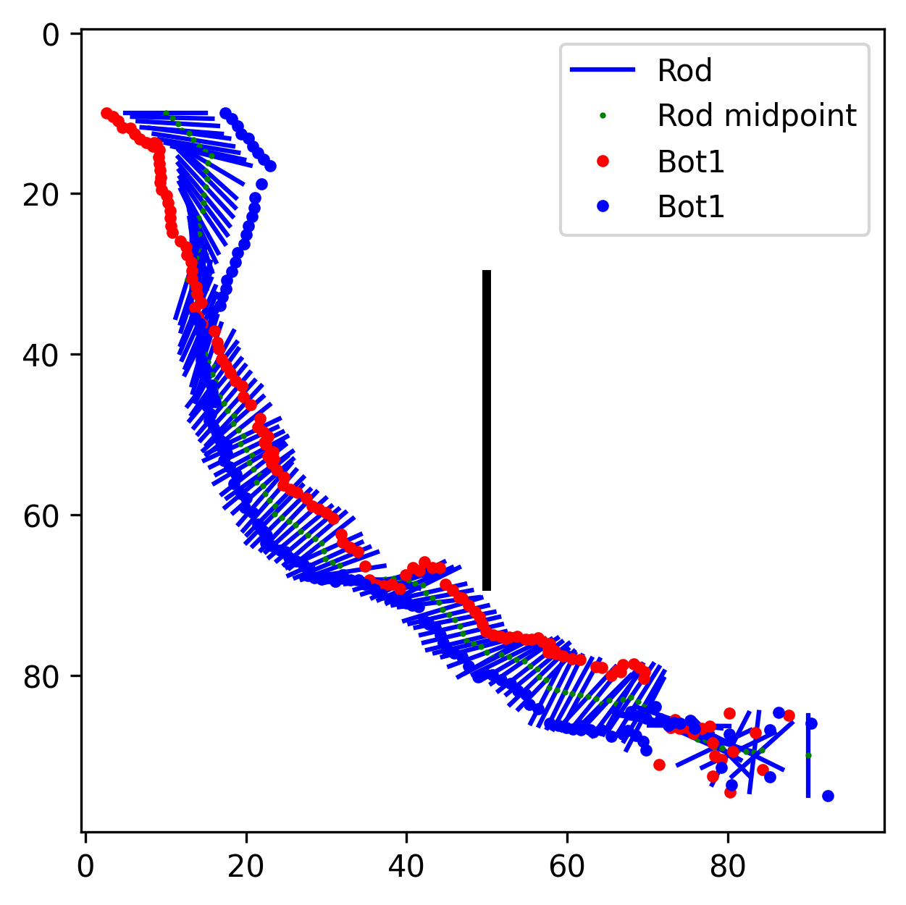
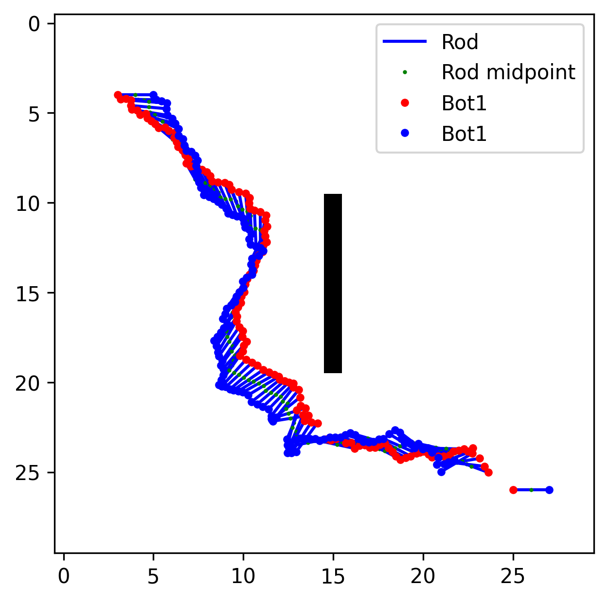

# Multi robot RRT

这个仓库是机器人学概论大作业的代码仓库，主要实现了两个带机械臂的机器人协同搬运一个杆的路径规划和运动控制参数计算的算法，基于RRT实现路径规划，基于IK实现运动参数计算。

---

## 📂 项目结构

- `main.py` — 主程序，包含 argparse 参数解析
- `map.py` - 地图类定义和生成程序，如果你想在新的地图上尝试这个算法，可以使用这个代码来生成地图文件
- 其他源代码文件

---

## ⚙️ 依赖环境

请确保已安装以下 Python 包：

- [numpy](https://numpy.org/)
- [matplotlib](https://matplotlib.org/)

如果需要保存生成的 MP4 动画，还需安装 [ffmpeg](https://ffmpeg.org/)：

```bash
# Python 包
pip install numpy matplotlib

# 安装 ffmpeg（示例，需根据操作系统调整）
# Ubuntu / Debian
sudo apt-get install ffmpeg

# macOS (使用 Homebrew)
brew install ffmpeg

# Windows (建议在conda环境中安装)
conda install ffmpeg
```

## 🚀 如何运行

在命令行中执行：

```bash
python main.py --map_name <MAP_NAME> --save_dir <SAVE_DIR> --smooth_degree <SMOOTH_DEGREE> --save_format <SAVE_FORMAT>
```

参数说明：

--map_name：地图文件名（必填），仓库中已经创建好的地图文件包括'large_map','small_map','complex_map'。

--save_dir：保存结果的输出文件夹，默认为你选择的地图名称，最后的输出会保存在'./results/{save_dir}/'路径下。

--smooth_degree：轨迹平滑程度，为正整数，数值越大，轨迹越平滑，但逆运动学计算耗时越长，默认值为2。

--save_format：结果保存格式，可选择'mp4'或'gif'，默认保存为gif。

运行示例：

```bash
python main.py --map_name large_map
```

## 📊 结果示例

下面展示一些运行后的示例输出：

| 原始路径示例 | 运动仿真示例 |
| ------------ | ------------- |
|   |   |
|   |   |


> 📂 *以上示例文件可在 `./results/` 文件夹中找到，实际输出将根据你的参数保存在 `--save_dir` 指定的文件夹中。*

